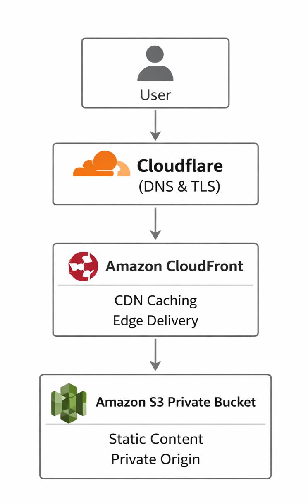

# AWS Static Website with Cloudflare and CloudFront

## Overview

This project demonstrates how to host a secure and scalable static website using Amazon S3 as the origin, CloudFront for content delivery, and Cloudflare for DNS and TLS.

The architecture reflects a hybrid edge design combining AWS-native services with external DNS and edge capabilities.

---

## Live Demo

Production site: https://frost.vip

This site is hosted using the architecture described in this repository.

---

## Architecture

Client  
→ Cloudflare (DNS, TLS)  
→ CloudFront (CDN, caching)  
→ Amazon S3 (private origin)

---

## Key Features

- Static website hosted on S3
- Private origin (no public bucket access)
- CloudFront CDN for caching and performance
- Cloudflare DNS and TLS management
- Custom domain (frost.vip)

---

## Tech Stack

- Amazon S3
- Amazon CloudFront
- Cloudflare (DNS + TLS)
- Static HTML/CSS

---

## Why This Project Matters

This project demonstrates:

- Understanding of layered CDN architecture
- Secure origin design using private S3
- Integration of AWS services with external providers
- Real-world tradeoffs between AWS-native and hybrid solutions

---

## Documentation

- [Architecture](docs/architecture.md)
- [Design Decisions](docs/decisions.md)
- [Future Improvements](docs/future-improvements.md)

---

## Future Improvements

- Infrastructure as Code (Terraform)
- CI/CD pipeline for deployments
- Monitoring and logging
- Multi-project hosting under one domain
